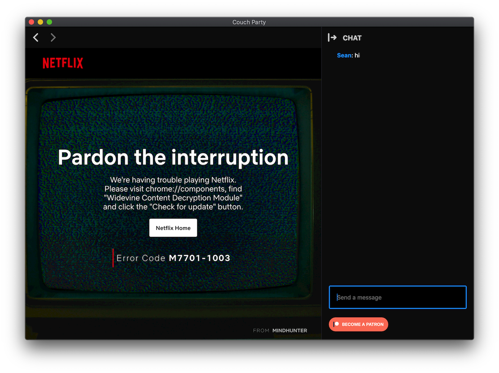

  

<h1 align="center">🎬 Couch Party</h1>

Started out as a project to let my friends watch Crave TV together. Initially just a Google Chrome Extension, the project grew to work with any streaming service that uses HTML5 video. Then to allow even more flexability (and a chance to learn electron) I decided to continue working on it as a standalone app. This was eventually met with a dead end that no amount of programming could evercome. Turns out browsers are shipped with a DRM library. The only one supported by Chromium is Google's Widevine but according to Google they are not open to supporting open source projects. I'd be happy to talk about this in greater detail another time.

## Future
If anything, this repo is a useful example of how to use Creact React App in Electon the right way.

## Features
 - Play/Pause/Seek synchronized
 - Sync on join. This is possible because the leader of the party pings the server with updated track information so that anyone joining starts with up-to-date state
 - Real-time chat. This can be hidden to enjoy a true full screen experience.
 - Planned to have scheduled public parties that anyone could join

## How to run
1. `yarn`
2. `yarn dev`

`yarn dev` starts the React development server and then Electron when it is ready. This was automated using Foreman.